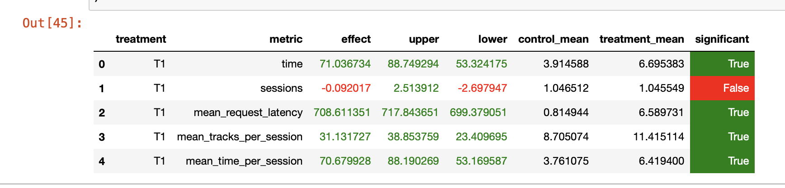

# МОБОД 2022: модуль _Рекомендательные Системы_

## Домашняя работа

### Идея
За основу взята модель contextual рекомендер из Week5Seminar.ipynb с доработками (HwRecommender.ipynb):
- добавлен эмбединг по пользователям
```
    def __init__(self, embedding_dim=10):
        super().__init__()
        self.embedding_dim = embedding_dim
        
        self.context = nn.Embedding(num_embeddings=50000, embedding_dim=self.embedding_dim)
        self.track = nn.Embedding(num_embeddings=50000, embedding_dim=self.embedding_dim)
        
        # HW
        self.user = nn.Embedding(num_embeddings=users_size, embedding_dim=self.embedding_dim)
```
- где предсказывание выглядит следующим образом
```
    def forward(self, x):
        context = self.context(x[:, 0])
        track = self.track(x[:, 1])
        user = self.user(x[:, 2])
        return torch.sum((context + user) * track, dim=1)
```
Сам рекомендер (hw_recommender.py) ведет себя следующим образом:
- если пришел первоначальный запрос или трек не найден в ембединге контекста, то рекомендуется рандомный трек
- дальше если пользователь не найден в эмбединге пользователей, то ведем себя как contextual рекомендер (contextual.py)
- иначе рандомно выбираем трек из топ-25 наиболее подходящих треков
```
    def recommend_next(self, user: int, prev_track: int, prev_track_time: float) -> int:
        if prev_track is None or prev_track >= self.context_embeddings.shape[0]:
            return self.fallback.recommend_next(user, prev_track, prev_track_time)

        context_embedding = self.context_embeddings[prev_track]

        if user >= self.user_embeddings.shape[0]:
            return self.get_recomendation(np.dot(context_embedding, self.track_embeddings))

        user_embedding = self.user_embeddings[user]

        return self.get_recomendation(np.dot(context_embedding + user_embedding, self.track_embeddings.T))

    def get_recomendation(self, scores):
        neighbours = np.argpartition(-scores, self.k)[:self.k]
        shuffled = list(neighbours)
        random.shuffle(shuffled)
        return int(shuffled[0])
```

Сам A/B экспериметр провододился при разделении запросов поровну между рекомендерами 
### Запуск
- запускаем сервис botify
```
из каталога botify 
docker-compose up -d --build
```
- запускаем симулятор (подробнее в recsys/sim/README.md)
```
из каталога sim
pip install -r requirements.txt
export PYTHONPATH=${PYTHONPATH}:.
python sim/run.py --episodes 1000 --recommender remote --config config/env.yml --seed 31337
```
- забираем файл логов
```
из каталога hw
docker cp recommender-container:/app/log/data.json <dest path>
```
- сравниваем результат нашего рекомендера и рекомендера с семинаров при помощи ноутбука (CompareResults.ipynb)

Итого получаем что наш рекомендер лучше семинарского почти по всем критерияем:


